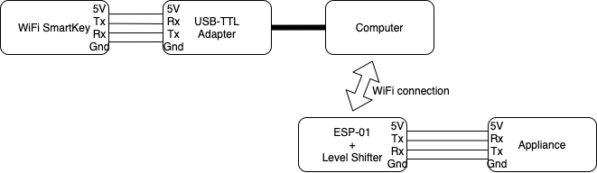

# Creating 

Prerequisites:

* ESP-01 + Level Shifter adapter (<https://nl.aliexpress.com/item/4001054021801.html>)
* USB-TTL adapter 5V ((<https://nl.aliexpress.com/item/32617951363.html>
* USB Type-A Female cable (4 wires) (<https://nl.aliexpress.com/item/4000143731716.html>))
* 4 Female Dupont connectors (or solder the wires of the cable to the USB-TTL adapter)
* esp-link firmware (<https://github.com/jeelabs/esp-link>)
* Soldering iron or Dupont connectors

## Creating the TCP-Serial Bridge

### The Hardware
Because the TTL levels of the appliance are 5V and the ESP8266 microcontrollers require 3.3V, level shifters are required for the Rx and Tx lines and a voltage regulator is required to feed the ESP from the 5V provided by the appliance.

The ESP-01 in combination with the level shifter adapter listed in the prerequisites provides exactly what we need.

### The Software

Jeelabs created the `esp-link` firmware for the ESP8266 family of microcontrollers, which perfectly fits our need.

To program the ESP-01 you need the USB-TTL adapter, note that it must support 5V levels. You connect the ESP-01 via the level shifter adapter to the USB-TTL adapter which is connected to your computer. How to flash the `esp-link` firmware onto the ESP-01 is described here <https://github.com/jeelabs/esp-link/blob/master/FLASHING.md>. Note: You have to connect the GPIO 0 pin of the ESP-01 to ground when powering it to have it boot into flash mode (I solder a switch between the GPIO-0 and GND pins to make this easy). You can also use a programmer board (<https://nl.aliexpress.com/item/4001053912859.html>) which has the switch already on-board.

## Connecting everything

The ESP-01 and adapter board can be powered using the 5V from the appliance. There are two types of connectors used to connect the WiFi SmartKey to the appliance:

* an USB connector
* a JST-XH connector

The drawing and table show which pins need to be connected.

| ESP-01 adapter | USB | JST-XH |
|-|-|-|
| Gnd | 4 | 4 |
| Vcc | 1 | 1 |
| Rx | 2 | 2 |
| Tx | 3 | 3 |

The WiFi SmartKey must be connected to the USB-TTL adapter and the USB-TTL adapter must be connected to your computer.

### Configure the ESP-Link firmware
When the adapter is flashed with the firmware and connected to the appliance it will start an access point that you can connect to configure the WiFi settings. See [WIFI-CONFIG.md](https://github.com/jeelabs/esp-link/blob/master/WIFI-CONFIG.md) for a description how to configure the network settings of the adapter.

When the network is configured, the connection to the appliance need to be set to 9600bps, 8 databits and no parity. You can do this by selecting the uC Console menu option. Set `Baud` to 9600 and `Fmt` to 8N1.

To configure the GPIO ports select the esp-01 preset on the home page.
